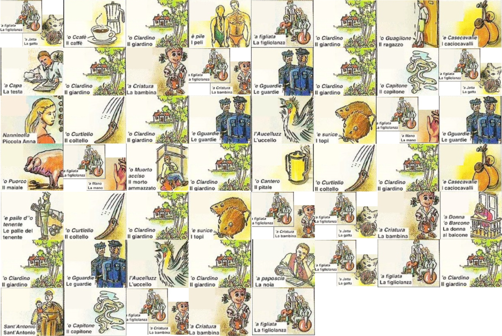
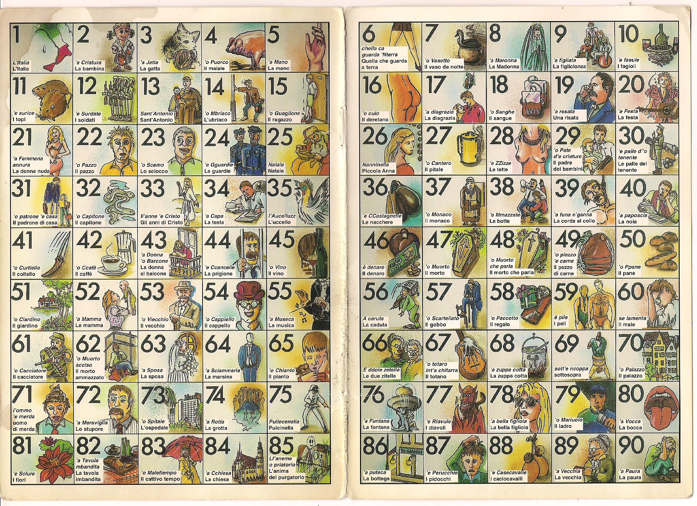

# A Lost Message
Description:
```
Once again, R-Boy has to discover where Zer0 went. Help him one more time to decrypt the space-time coordinates.
```
Files: [chal.zip](chal.zip)

We are given two files in the zip:
- [traccia.docx](traccia.docx)
- [key.png](key.png)

The word file content:
```
Jack and Kate are good friends. They met thanks to a tragic event: they survived a plane crash. Their plane, called OCEANIC 815, crashed a few years ago on an island in the middle of the ocean. However, this island is a mysterious island, unknown to anyone and there is no trace of it on known maps. In addition, they will discover that it can change geographical position and move back and forward in time.

Without explaining how well, after 15 weeks and 3 days they escaped from it and returned home. They never revealed anything particular about the island, so as to protect it. By now they have become famous people and are tormented by the media, intrigued by this event.

Jack, a computer security lover, finds a way to keep in touch with Kate without being spied on. He sends her a meaningless message and a key; the comparison between them hides the true message. This key is different every time, but always has the same structure: it is formed by a collage of images taken from Neapolitan culture, found inside a cave on the island. Next to these images, on a wall there was an inscription: SMORFIA. Kate remembers those graffiti well, she knows what those images correspond to and she knows what she has to do in order to get a meaningful sentence.

One day when Jack was feeling particularly depressed, he decided to send a message to Kate and the key with which she could decipher the message.
The message is as follows:
0x727f00340e075a6b3a69146f2d3e3a67403c343e101d052b1a58623d3c1a0e53087c00245b6e00771d1f1005316e08693e24000714
P.S.: Remember the time we spent on the island. It will help you!

First of all, Kate deciphers the key. She gets a sentence and smiles because it's a sentence that Jack said once on the island. Kate now knows that she must compare the key she obtained and the message she received in order to discover Jack's true message.
But that's not all: she has to follow the passages of an ancient manuscript always found on the island; this manuscript is written in Latin and was written by a young emperor who also mysteriously passed from that island a few years ago. 

Once the operation is over, Jack's message will leave her speechless!
```
So we need to decrypt the Jack's message `727f00340e075a6b3a69146f2d3e3a67403c343e101d052b1a58623d3c1a0e53087c00245b6e00771d1f1005316e08693e24000714`, obviously it is **hexadecimal**

We got a key file image:



It contain 53 pictures of something written in Italian

Notice the hex value given is also 53 character length

It mention about `Neapolitan` and `smorfia`

After a quick google search, I realize those picture came from a guidebook which for the interpretation of dreams, association of numbers and betting for the game of Lotto

The guidebook picture:


You can see **each picture represent a number**, therefore we need to **translate all picture from the key image into numbers**

Translated keys:
```
93,42,51,59,9,51,15,88,
34,51,2,92,24,51,32,93,
26,41,51,24,35,11,95,24,
4,95,62,51,27,41,51,88,
30,41,51,11,92,93,2,43,
51,24,35,51,40,93,9,51,
13,32,92,2,9
```
Then we need to guess how to decrypt it, I will try XORing first

I used Python to work with it:
```py
from pwn import xor
key = bytearray([
		93,42,51,59,9,51,15,88,
		34,51,2,92,24,51,32,93,
		26,41,51,24,35,11,95,24,
		4,95,62,51,27,41,51,88,
		30,41,51,11,92,93,2,43,
		51,24,35,51,40,93,9,51,
		13,32,92,2,9])

text = "727f00340e075a6b3a69146f2d3e3a67403c343e101d052b1a58623d3c1a0e53087c00245b6e00771d1f1005316e08693e24000714".decode("hex")
print xor(text,key)
```
Result:
```
/U34U3Z35
:Z&3Z3\'3=U3/3\.363Z3\
```
The result seems not the flag, then I realize a P.S from the word file:
```
P.S.: Remember the time we spent on the island. It will help you!
```
Then I calculate the time they spent which is `15 weeks and 3 days = 108 days`

XORing with the result, we see something readable:
```py
print xor(xor(text,key),108)
```
Result:
```py
C9_ckX9_t6z_YavV6ykJ_z6_rk0bK_Qgz9_Ck_n0Bk_Zu_m6_h0iq
```
Looks like encrypted..

Tried Caesar Cipher and found the flag!!
```
W9_weR9_n6t_SupP6seD_t6_le0vE_Kat9_We_h0Ve_To_g6_b0ck
```
Before we submit, notice there were some character is wrong: `9` is `3`, `6` is `0` and `0` is `4`

After replacing all the characters, we got it right!!

[Full python script](solve.py)

## Flag
```
{FLG:W3_weR3_n0t_SupP0seD_t0_le4vE_Kat3_We_h4Ve_To_g0_b4ck}
```